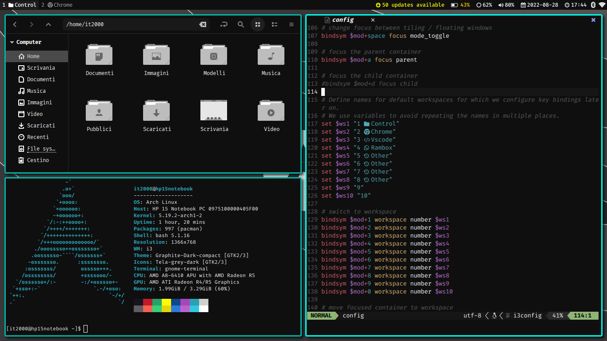
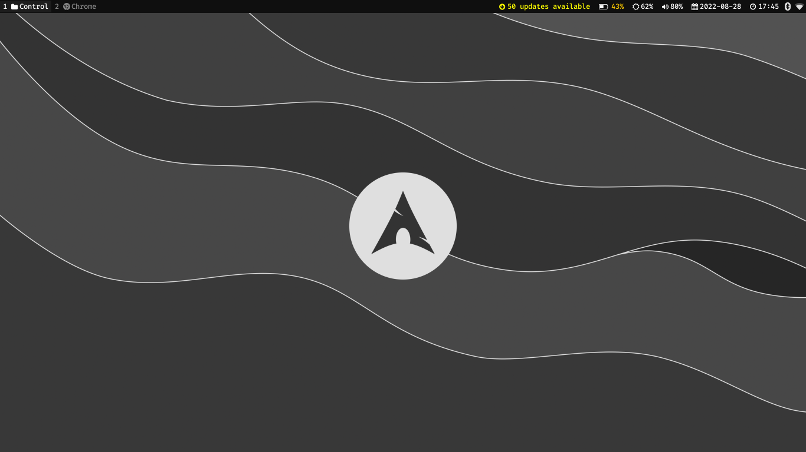
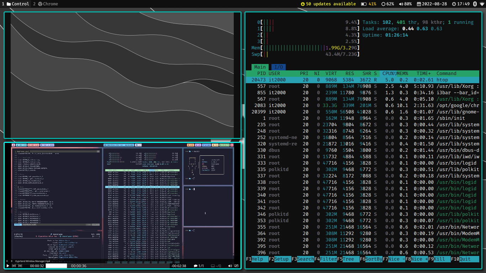

# i3wm-Doftiles

This is a simple configuration thought for arch linux of i3wm and some recomended apps, it uses the [Graphite-gtk-theme](https://github.com/vinceliuice/Graphite-gtk-theme) with the black and compact tweak modfied to remove rounded edges, the [Tela-icon-theme](https://github.com/vinceliuice/Tela-icon-theme) with the grey color variant and the [Graphite-cursors](https://github.com/vinceliuice/Graphite-cursors.git).

## Configurations

this repository include configurations for:

* [i3](https://github.com/i3/i3.git) with 3px pixel border graphite gtk themes and fira code fonts
* [i3-gaps](https://github.com/i3/i3.git) with a small gaps inner and outher
* [rofi](https://github.com/davatorium/rofi) as applications launcher to launch .desktop files, it is set to $mod+d shortcut and include a simple power menu mapped to the power button but to make this i had to change the /etc/systemd/logind.conf file to ignore a simple power button pressure
* [dunst](https://github.com/dunst-project/dunst) as notification daemon with the same color and border radius of rofi
* [feh](https://github.com/derf/feh) as default image viewer with a custom .desktop file il .local/share/applications that launch the applicatin with custom options for example to hab the same color of the theme as background color
* [mpv](https://github.com/mpv-player/mpv) with a simple config option to don't close the player when a video end
* [i3bloks](https://github.com/vivien/i3blocks) to have on the status bar an update indicator for arch, a battery status block, a brightness indicator (You can change the brightness with functional keys in the keyboard like for the volume), a volume indicator, a calendar and a clock
* [picom](https://github.com/yshui/picom) to have rounded corners and a shadow under the windows
* [neovim](https://github.com/neovim/neovim) with vim-plug (You need to run :PlugInstall to install all plugins) and with [onedark](https://github.com/navarasu/onedark.nvim) colorscheme modfied with a custom color variant called graphite to the same colors of the theme
* [nemo](https://github.com/linuxmint/nemo) as default file manager assigned to the first workspace

## Install Dependencies

You need to install the dependency packages to install this config (Is planned that you have installed [yay](https://github.com/Jguer/yay.git)).

```
yay -S i3 rofi dunst feh mpv picom neovim nemo cinnamon-translations network-manager-applet blueman xss-lock ttf-fira-code nerd-fonts-fira-code python python-pip pacman-contrib brightnessctl acpi pulseaudio alsa polkit polkit-gnome
pip install pynvim
```

## Installation

To install this config you can simply move in the repository directory and execute the install.sh script, it will create a backup folder where put all default files already existents.

```
./install.sh
```
## Uninstallation

To uninstall the config you can simpy run the uninstall.sh script, it will remove all configuration file and will put the file of the backupfiles folder but WARNING it must be the same folder that you have used to install the config, do not think about to uninstall the config coloning the repository another time.

```
./uninstall.sh
```

## Screenshots




